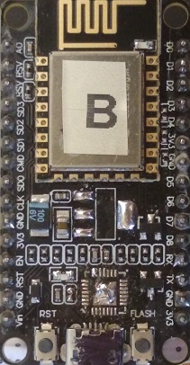
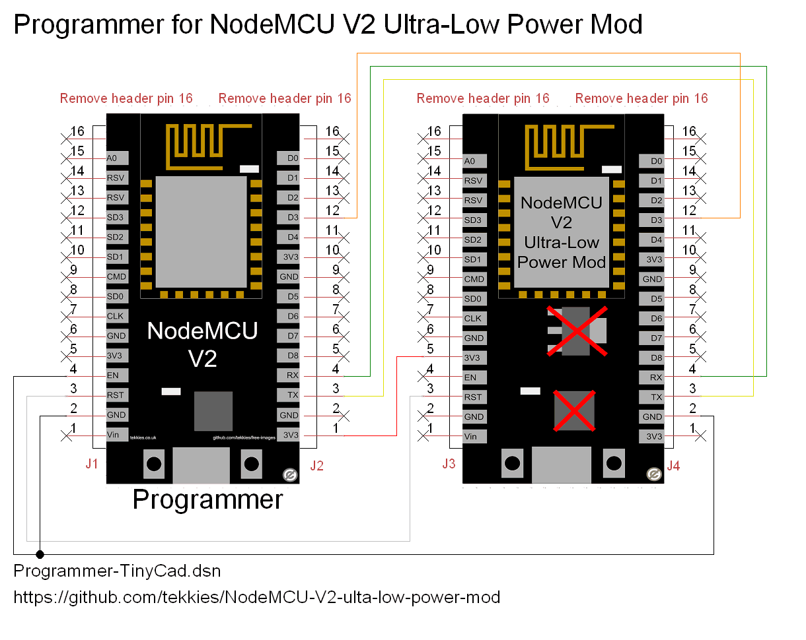
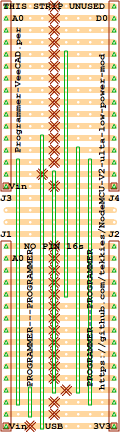

# NodeMCU V2 Ultra-Low Power Mod <20µA

By removing the CP2012 USB IC and 3.3v Regulator from a NodeMCU and powering directy from the 3.3v pin, the module can run at 20µA when in deep sleep mode.

As the ESP8266 IC can run at 2.6V to 3.6V, you power the NodeMCU by connecting 2x AA batteries directly to theGND and 3V3 pin.  This includes NiMH rechargable batteries.

**WARNING:** Do not connect AA batteries directly to the 3V3 pin when USB is attached to a NodeMCU, otherwise, current will flow into the battery.

**The USB port and Vin pin will no-longer work, however you can use another unmodified NodeMCU to communicate with the modified NodeMCU.**

## Flashing and Programming the modified NodeMCU

You can hotwire the modified NodeMCU onto a stock NodeMCU to flash or program or communicate with it.

## Programmer Strip Board Layout
